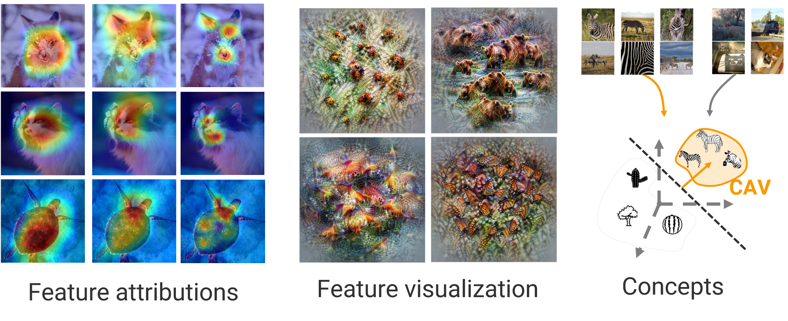
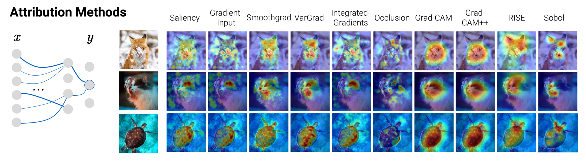
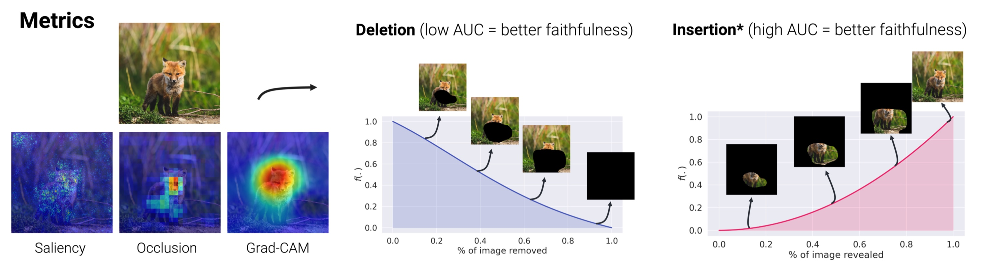
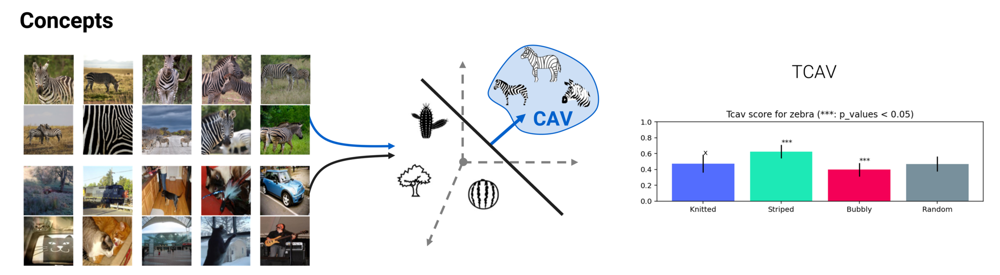
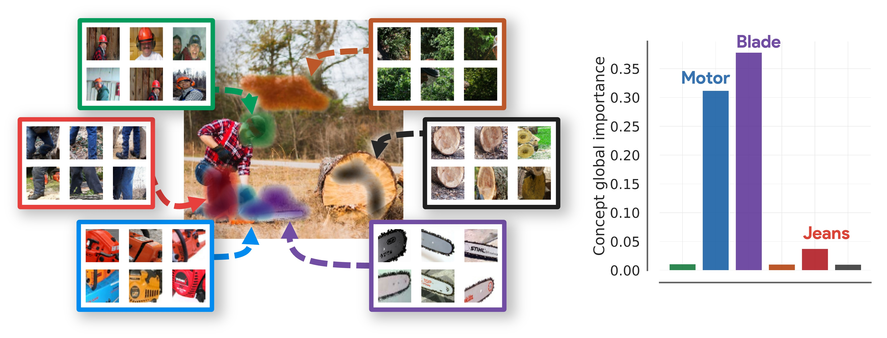
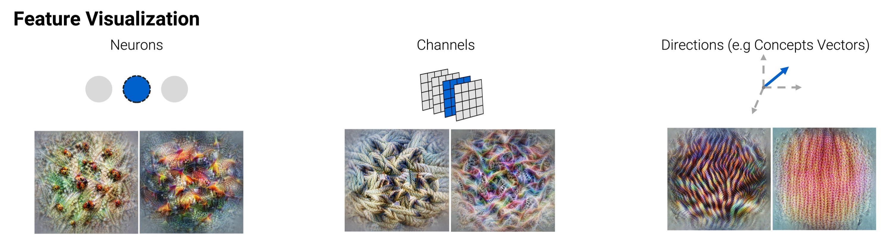

<div align="center">
    
</div>
<br>

<div align="center">
    <a href="#">
        
    </a>
    <a href="https://github.com/deel-ai/xplique/actions/workflows/python-lints.yml">
        
    </a>
    <a href="https://github.com/deel-ai/xplique/actions/workflows/python-tests.yml">
        
    </a>
    <a href="https://github.com/deel-ai/xplique/actions/workflows/python-publish.yml">
        
    </a>
    <a href="https://pepy.tech/project/xplique">
        
    </a>
    <a href="#">
        
    </a>
</div>
<br>

<p align="center">
    🦊 <b>Xplique</b> (pronounced <i>\ɛks.plik\</i>) is a Python toolkit dedicated to explainability. The goal of this library is to gather the state of the art of Explainable AI to help you understand your complex neural network models. Originally built for Tensorflow's model it also works for PyTorch models partially.

  <br>
  <a href="https://deel-ai.github.io/xplique/">📘 <strong>Explore Xplique docs</strong></a>
    |  
  <a href="https://deel-ai.github.io/xplique/latest/tutorials/"><strong>Explore Xplique tutorials</strong> 🔥</a>
  <br>
  <br>
  <a href="https://deel-ai.github.io/xplique/latest/api/attributions/api_attributions/">Attributions</a>
  ·
  <a href="https://deel-ai.github.io/xplique/latest/api/concepts/cav/">Concept</a>
  ·
  <a href="https://deel-ai.github.io/xplique/latest/api/feature_viz/feature_viz/">Feature Visualization</a>
  ·
  <a href="https://deel-ai.github.io/xplique/latest/api/attributions/metrics/api_metrics/">Metrics</a>
</p>

The library is composed of several modules, the _Attributions Methods_ module implements various methods (e.g Saliency, Grad-CAM, Integrated-Gradients...), with explanations, examples and links to official papers.
The _Feature Visualization_ module allows to see how neural networks build their understanding of images by finding inputs that maximize neurons, channels, layers or compositions of these elements.
The _Concepts_ module allows you to extract human concepts from a model and to test their usefulness with respect to a class.
Finally, the _Metrics_ module covers the current metrics used in explainability. Used in conjunction with the _Attribution Methods_ module, it allows you to test the different methods or evaluate the explanations of a model.

<p align="center" width="100%">
    
</p>

<br>

## 🔥 Tutorials

<details>
<summary>We propose some Hands-on tutorials to get familiar with the library and its api:</summary>

- [**Attribution Methods**: Getting started](https://colab.research.google.com/drive/1XproaVxXjO9nrBSyyy7BuKJ1vy21iHs2) <sub> [](https://colab.research.google.com/drive/1XproaVxXjO9nrBSyyy7BuKJ1vy21iHs2) </sub>

<p align="center" width="100%">
    <a href="https://colab.research.google.com/drive/1XproaVxXjO9nrBSyyy7BuKJ1vy21iHs2">
        
    </a>
</p>

- [**Attribution Methods**: Sanity checks paper](https://colab.research.google.com/drive/1uJOmAg6RjlOIJj6SWN9sYRamBdHAuyaS) <sub> [](https://colab.research.google.com/drive/1uJOmAg6RjlOIJj6SWN9sYRamBdHAuyaS) </sub>
- [**Attribution Methods**: Tabular data and Regression](https://colab.research.google.com/drive/1pjDJmAa9oeSquYtbYh6tksU6eTmObIcq) <sub> [](https://colab.research.google.com/drive/1pjDJmAa9oeSquYtbYh6tksU6eTmObIcq) </sub>
- [**Attribution Methods**: Object Detection](https://colab.research.google.com/drive/1X3Yq7BduMKqTA0XEheoVIpOo3IvOrzWL) <sub> [](https://colab.research.google.com/drive/1X3Yq7BduMKqTA0XEheoVIpOo3IvOrzWL) </sub>
- [**Attribution Methods**: Semantic Segmentation](https://colab.research.google.com/drive/1AHg7KO1fCOX5nZLGZfxkZ2-DLPPdSfbX) <sub> [](https://colab.research.google.com/drive/1AHg7KO1fCOX5nZLGZfxkZ2-DLPPdSfbX) </sub>
- [**FORGRad**: Gradient strikes back with FORGrad](https://colab.research.google.com/drive/1ibLzn7r9QQIEmZxApObowzx8n9ukinYB) <sub> [](https://colab.research.google.com/drive/1ibLzn7r9QQIEmZxApObowzx8n9ukinYB) </sub>
- [**Attribution Methods**: Metrics](https://colab.research.google.com/drive/1WEpVpFSq-oL1Ejugr8Ojb3tcbqXIOPBg) <sub> [](https://colab.research.google.com/drive/1WEpVpFSq-oL1Ejugr8Ojb3tcbqXIOPBg) </sub>

<p align="center" width="100%">
    <a href="https://colab.research.google.com/drive/1WEpVpFSq-oL1Ejugr8Ojb3tcbqXIOPBg"> 
        
    </a>
</p>

- [**PyTorch models**: Getting started](https://colab.research.google.com/drive/1bMlO29_0K3YnTQBbbyKQyRfo8YjvDbhe)<sub> [](https://colab.research.google.com/drive/1bMlO29_0K3YnTQBbbyKQyRfo8YjvDbhe) </sub>
 
- [**Concepts Methods**: Testing with Concept Activation Vectors](https://colab.research.google.com/drive/1iuEz46ZjgG97vTBH8p-vod3y14UETvVE) <sub> [](https://colab.research.google.com/drive/1iuEz46ZjgG97vTBH8p-vod3y14UETvVE) </sub>

<p align="center" width="100%">
    <a href="https://colab.research.google.com/drive/1iuEz46ZjgG97vTBH8p-vod3y14UETvVE">
        
    </a>
</p>

- [**Concepts Methods**: CRAFT: Getting started on Tensorflow](https://colab.research.google.com/drive/1jmyhb89Bdz7H4G2KfK8uEVbSC-C_aht_)
<sub> [](https://colab.research.google.com/drive/1jmyhb89Bdz7H4G2KfK8uEVbSC-C_aht_) </sub>
- [**Concepts Methods**: CRAFT: Getting started on Pytorch](https://colab.research.google.com/drive/16Jn2pQy4gi2qQYZFnuW6ZNtVAYiNyJHO)
<sub> [](https://colab.research.google.com/drive/16Jn2pQy4gi2qQYZFnuW6ZNtVAYiNyJHO) </sub>

<p align="center" width="100%">
    <a href="https://colab.research.google.com/drive/1jmyhb89Bdz7H4G2KfK8uEVbSC-C_aht_">
        
    </a>
</p>

- [**Feature Visualization**: Getting started](https://colab.research.google.com/drive/1st43K9AH-UL4eZM1S4QdyrOi7Epa5K8v) <sub> [](https://colab.research.google.com/drive/1st43K9AH-UL4eZM1S4QdyrOi7Epa5K8v) </sub>
- [**Modern Feature Visualization with MaCo**: Getting started](https://colab.research.google.com/drive/1l0kag1o-qMY4NCbWuAwnuzkzd9sf92ic) <sub> [](https://colab.research.google.com/drive/1l0kag1o-qMY4NCbWuAwnuzkzd9sf92ic) </sub>

<p align="center" width="100%">
    <a href="https://colab.research.google.com/drive/1st43K9AH-UL4eZM1S4QdyrOi7Epa5K8v"> 
        
    </a>
</p>

You can find a certain number of [**other practical tutorials just here**](https://github.com/deel-ai/xplique/blob/master/TUTORIALS.md). This section is actively developed and more contents will be
included. We will try to cover all the possible usage of the library, feel free to contact us if you have any suggestions or recommendations towards tutorials you would like to see.

</details>

## 🚀 Quick Start

Xplique requires a version of python higher than 3.7 and several libraries including Tensorflow and Numpy. Installation can be done using Pypi:

```python
pip install xplique
```

Now that Xplique is installed, here are basic examples of what you can do with the available modules.

<details>
<summary><b>Attributions Methods</b></summary>
Let's start with a simple example, by computing Grad-CAM for several images (or a complete dataset) on a trained model.

```python
from xplique.attributions import GradCAM

# load images, labels and model
# ...

explainer = GradCAM(model)
explanations = explainer.explain(images, labels)
# or just `explainer(images, labels)`
```

All attributions methods share a common API described [in the attributions API documentation](https://deel-ai.github.io/xplique/latest/api/attributions/api_attributions/).

</details>

<details>
<summary><b>Attributions Metrics</b></summary>

In order to measure if the explanations provided by our method are faithful (it reflects well the functioning of the model) we can use a fidelity metric such as Deletion

```python
from xplique.attributions import GradCAM
from xplique.metrics import Deletion

# load images, labels and model
# ...

explainer = GradCAM(model)
explanations = explainer(inputs, labels)
metric = Deletion(model, inputs, labels)

score_grad_cam = metric(explanations)
```

All attributions metrics share a common API. You can find out more about it [here](https://deel-ai.github.io/xplique/latest/api/attributions/metrics/api_metrics/).

</details>

<details>
<summary><b>Concepts Extraction</b></summary>

### CAV

Concerning the concept-based methods, we can for example extract a concept vector from a layer of a model. In order to do this, we use two datasets, one containing inputs containing the concept: `positive_samples`, the other containing other entries which do not contain the concept: `negative_samples`.

```python
from xplique.concepts import Cav

# load a model, samples that contain a concept
# (positive) and samples who don't (negative)
# ...

extractor = Cav(model, 'mixed3')
concept_vector = extractor(positive_samples,
                           negative_samples)
```

More information on CAV [here](https://deel-ai.github.io/xplique/latest/api/concepts/cav/) and on TCAV [here](https://deel-ai.github.io/xplique/latest/api/concepts/tcav/).

### CRAFT

Use Craft to investigate a single class.

```python
from xplique.concepts import CraftTf as Craft

# Cut the model in two parts: g and h
# Create a Craft concept extractor from these 2 models
craft = Craft(input_to_latent_model = g,
              latent_to_logit_model = h)

# Use Craft to compute the concepts for a specific class
craft.fit(images_preprocessed, class_id=rabbit_class_id)

# Compute Sobol indices to understand which concept matters
importances = craft.estimate_importance()

# Display those concepts by showing the 10 best crops for each concept
craft.plot_concepts_crops(nb_crops=10)

```

More information in the [CRAFT documentation](https://deel-ai.github.io/xplique/latest/api/concepts/craft/).

</details>

<details>
<summary><b>Feature Visualization</b></summary>

Finally, in order to find an image that maximizes a neuron and at the same time a layer, we build two objectives that we combine together. We then call the optimizer which returns our images

```python
from xplique.features_visualizations import Objective
from xplique.features_visualizations import optimize

# load a model...

neuron_obj = Objective.neuron(model, "logits", 200)
channel_obj = Objective.layer(model, "mixed3", 10)

obj = neuron_obj + 2.0 * channel_obj
images, obj_names = optimize(obj)
```

Want to know more ? Check the Feature Viz [documentation](https://deel-ai.github.io/xplique/latest/api/feature_viz/feature_viz/)
</details>

<details>
<summary><b>PyTorch with Xplique</b></summary>

Even though the library was mainly designed to be a Tensorflow toolbox we have been working on a very practical wrapper to facilitate the integration of your PyTorch models into Xplique's framework!

```python
import torch

from xplique.wrappers import TorchWrapper
from xplique.attributions import Saliency
from xplique.metrics import Deletion

# load images, targets and model
# ...

device = 'cuda' if torch.cuda.is_available() else 'cpu'
wrapped_model = TorchWrapper(torch_model, device)

explainer = Saliency(wrapped_model)
explanations = explainer(inputs, targets)

metric = Deletion(wrapped_model, inputs, targets)
score_saliency = metric(explanations)
```

Want to know more ? Check the [PyTorch documentation](https://deel-ai.github.io/xplique/latest/api/attributions/pytorch/)

</details>

## 📦 What's Included

There are 4 modules in Xplique, [Attribution methods](https://deel-ai.github.io/xplique/latest/api/attributions/api_attributions/), [Attribution metrics](https://deel-ai.github.io/xplique/latest/api/attributions/metrics/api_metrics/), [Concepts](https://deel-ai.github.io/xplique/latest/api/concepts/cav/), and [Feature visualization](https://deel-ai.github.io/xplique/latest/api/feature_viz/feature_viz/). In particular, the attribution methods module supports a huge diversity of tasks:[Classification](https://deel-ai.github.io/xplique/latest/api/attributions/classification/), [Regression](https://deel-ai.github.io/xplique/latest/api/attributions/regression/), [Object Detection](https://deel-ai.github.io/xplique/latest/api/attributions/object_detection/), and [Semantic Segmentation](https://deel-ai.github.io/xplique/latest/api/attributions/semantic_segmentation/). For diverse data types: [Images, Time Series, and Tabular data](https://deel-ai.github.io/xplique/latest/api/attributions/api_attributions/). The methods compatible with such task are highlighted in the following table:


<details>
<summary><b>Table of attributions available</b></summary>

| **Attribution Method** | Type of Model            | Source                                    | Images         | Time Series and Tabular Data | Tutorial  |
| :--------------------- | :----------------------- | :---------------------------------------- | :------------: | :--------------------------: | :-------: |
| Deconvolution          | TF                       | [Paper](https://arxiv.org/abs/1311.2901)  | C✔️ OD❌ SS❌ | C✔️ R✔️ | [](https://colab.research.google.com/drive/19eB3uwAtCKZgkoWtMzrF0LTJ-htF_KE7) |
| Grad-CAM               | TF                       | [Paper](https://arxiv.org/abs/1610.02391) | C✔️ OD❌ SS❌ | ❌      | [](https://colab.research.google.com/drive/1nsB7xdQbU0zeYQ1-aB_D-M67-RAnvt4X) |
| Grad-CAM++             | TF                       | [Paper](https://arxiv.org/abs/1710.11063) | C✔️ OD❌ SS❌ | ❌      | [](https://colab.research.google.com/drive/1nsB7xdQbU0zeYQ1-aB_D-M67-RAnvt4X) |
| Gradient Input         | TF, PyTorch**            | [Paper](https://arxiv.org/abs/1704.02685) | C✔️ OD✔️ SS✔️ | C✔️ R✔️ | [](https://colab.research.google.com/drive/19eB3uwAtCKZgkoWtMzrF0LTJ-htF_KE7) |
| Guided Backprop        | TF                       | [Paper](https://arxiv.org/abs/1412.6806)  | C✔️ OD❌ SS❌ | C✔️ R✔️ | [](https://colab.research.google.com/drive/19eB3uwAtCKZgkoWtMzrF0LTJ-htF_KE7) |
| Integrated Gradients   | TF, PyTorch**            | [Paper](https://arxiv.org/abs/1703.01365) | C✔️ OD✔️ SS✔️ | C✔️ R✔️ | [](https://colab.research.google.com/drive/1UXJYVebDVIrkTOaOl-Zk6pHG3LWkPcLo) |
| Kernel SHAP            | TF, PyTorch**, Callable* | [Paper](https://arxiv.org/abs/1705.07874) | C✔️ OD✔️ SS✔️ | C✔️ R✔️ | [](https://colab.research.google.com/drive/1frholXRE4XQQ3W5yZuPQ2-xqc-LTczfT) |
| Lime                   | TF, PyTorch**, Callable* | [Paper](https://arxiv.org/abs/1602.04938) | C✔️ OD✔️ SS✔️ | C✔️ R✔️ | [](https://colab.research.google.com/drive/1frholXRE4XQQ3W5yZuPQ2-xqc-LTczfT) |
| Occlusion              | TF, PyTorch**, Callable* | [Paper](https://arxiv.org/abs/1311.2901)  | C✔️ OD✔️ SS✔️ | C✔️ R✔️ | [](https://colab.research.google.com/drive/15xmmlxQkNqNuXgHO51eKogXvLgs-sG4q) |
| Rise                   | TF, PyTorch**, Callable* | [Paper](https://arxiv.org/abs/1806.07421) | C✔️ OD✔️ SS✔️ | C✔️ R✔️ | [](https://colab.research.google.com/drive/1icu2b1JGfpTRa-ic8tBSXnqqfuCGW2mO) |
| Saliency               | TF, PyTorch**            | [Paper](https://arxiv.org/abs/1312.6034)  | C✔️ OD✔️ SS✔️ | C✔️ R✔️ | [](https://colab.research.google.com/drive/19eB3uwAtCKZgkoWtMzrF0LTJ-htF_KE7) |
| SmoothGrad             | TF, PyTorch**            | [Paper](https://arxiv.org/abs/1706.03825) | C✔️ OD✔️ SS✔️ | C✔️ R✔️ | [](https://colab.research.google.com/drive/12-tlM_TdZ12oc5lNL2S2g-hcMJV8tZUD) |
| SquareGrad             | TF, PyTorch**            | [Paper](https://arxiv.org/abs/1806.10758) | C✔️ OD✔️ SS✔️ | C✔️ R✔️ | [](https://colab.research.google.com/drive/12-tlM_TdZ12oc5lNL2S2g-hcMJV8tZUD) |
| VarGrad                | TF, PyTorch**            | [Paper](https://arxiv.org/abs/1810.03292) | C✔️ OD✔️ SS✔️ | C✔️ R✔️ | [](https://colab.research.google.com/drive/12-tlM_TdZ12oc5lNL2S2g-hcMJV8tZUD) |
| Sobol Attribution      | TF, PyTorch**            | [Paper](https://arxiv.org/abs/2111.04138) | C✔️ OD✔️ SS✔️ | 🔵      | [](https://colab.research.google.com/drive/1XproaVxXjO9nrBSyyy7BuKJ1vy21iHs2) |
| Hsic Attribution       | TF, PyTorch**            | [Paper](https://arxiv.org/abs/2206.06219) | C✔️ OD✔️ SS✔️ | 🔵      | [](https://colab.research.google.com/drive/1XproaVxXjO9nrBSyyy7BuKJ1vy21iHs2) |
| FORGrad enhancement    | TF, PyTorch**            | [Paper](https://arxiv.org/abs/2307.09591) | C✔️ OD✔️ SS✔️ | ❌      | [](https://colab.research.google.com/drive/1ibLzn7r9QQIEmZxApObowzx8n9ukinYB) |

TF : Tensorflow compatible

C : [Classification](https://deel-ai.github.io/xplique/latest/api/attributions/classification/) | R : [Regression](https://deel-ai.github.io/xplique/latest/api/attributions/regression/) |
OD : [Object Detection](https://deel-ai.github.io/xplique/latest/api/attributions/object_detection/) | SS :  [Semantic Segmentation (SS)](https://deel-ai.github.io/xplique/latest/api/attributions/semantic_segmentation/)

\* : See the [Callable documentation](https://deel-ai.github.io/xplique/latest/api/attributions/callable/)

** : See the [Xplique for PyTorch documentation](https://deel-ai.github.io/xplique/latest/api/attributions/pytorch/), and the [**PyTorch models**: Getting started](https://colab.research.google.com/drive/1bMlO29_0K3YnTQBbbyKQyRfo8YjvDbhe) notebook.

✔️ : Supported by Xplique | ❌ : Not applicable | 🔵 : Work in Progress

</details>

<details>
<summary><b>Table of attribution's metric available</b></summary>

| **Attribution Metrics** | Type of Model | Property         | Source                                    |
| :---------------------- | :------------ | :--------------- | :---------------------------------------- |
| MuFidelity              | TF, PyTorch** | Fidelity         | [Paper](https://arxiv.org/abs/2005.00631) |
| Deletion                | TF, PyTorch** | Fidelity         | [Paper](https://arxiv.org/abs/1806.07421) |
| Insertion               | TF, PyTorch** | Fidelity         | [Paper](https://arxiv.org/abs/1806.07421) |
| Average Stability       | TF, PyTorch** | Stability        | [Paper](https://arxiv.org/abs/2005.00631) |
| MeGe                    | TF, PyTorch** | Representativity | [Paper](https://arxiv.org/abs/2009.04521) |
| ReCo                    | TF, PyTorch** | Consistency      | [Paper](https://arxiv.org/abs/2009.04521) |
| (WIP) e-robustness      |

TF : Tensorflow compatible

** : See the [Xplique for PyTorch documentation](https://deel-ai.github.io/xplique/latest/api/attributions/pytorch/), and the [**PyTorch models**: Getting started](https://colab.research.google.com/drive/1bMlO29_0K3YnTQBbbyKQyRfo8YjvDbhe) notebook.

</details>

<details>
<summary><b>Table of concept methods available</b></summary>

| **Concepts method**             | Type of Model | Source                                        | Tutorial       |
| :------------------------------ | :------------ | :-------------------------------------------- | :------------  |
| Concept Activation Vector (CAV) | TF            | [Paper](https://arxiv.org/pdf/1711.11279.pdf) | |
| Testing CAV (TCAV)              | TF            | [Paper](https://arxiv.org/pdf/1711.11279.pdf) | |
| CRAFT Tensorflow | TF | [Paper](https://arxiv.org/pdf/2211.10154.pdf) | [](https://colab.research.google.com/drive/1jmyhb89Bdz7H4G2KfK8uEVbSC-C_aht_) |
| CRAFT PyTorch  | PyTorch** | [Paper](https://arxiv.org/pdf/2211.10154.pdf) | [](https://colab.research.google.com/drive/16Jn2pQy4gi2qQYZFnuW6ZNtVAYiNyJHO) |
| (WIP) Robust TCAV               |               | | |
| (WIP) Automatic Concept Extraction (ACE)        | | |

TF : Tensorflow compatible

** : See the [Xplique for Pytorch documentation](https://deel-ai.github.io/xplique/latest/pytorch/), and the [**PyTorch's model**: Getting started](https://colab.research.google.com/drive/1bMlO29_0K3YnTQBbbyKQyRfo8YjvDbhe)<sub> [](https://colab.research.google.com/drive/1bMlO29_0K3YnTQBbbyKQyRfo8YjvDbhe) </sub> notebook

</details>

<details>
<summary><b>Table of Feature Visualization methods available</b></summary>

| **Feature Visualization** [(Paper)](https://distill.pub/2017/feature-visualization/) | Type of Model | Details                                                                                                            |
| :----------------------------------------------------------------------------------- | :------------ | :----------------------------------------------------------------------------------------------------------------- |
| Neurons                                                                              | TF            | Optimizes for specific neurons                                                                              |
| Layer                                                                                | TF            | Optimizes for specific layers                                                                               |
| Channel                                                                              | TF            | Optimizes for specific channels                                                                             |
| Direction                                                                            | TF            | Optimizes for specific vector                                                                               |
| Fourrier Preconditioning                                                             | TF            | Optimize in Fourier basis (see [preconditioning](https://distill.pub/2017/feature-visualization/#preconditioning)) |
| Objective combination                                                                | TF            | Allows to combine objectives                                                                                       |
| MaCo                                                                                 | TF            | Fixed Magnitude optimisation, see [Paper](https://arxiv.org/pdf/2306.06805.pdf)                                                                                       |


TF : Tensorflow compatible

</details>

## 👍 Contributing

Feel free to propose your ideas or come and contribute with us on the Xplique toolbox! We have a specific document where we describe in a simple way how to make your first pull request: [just here](https://github.com/deel-ai/xplique/blob/master/CONTRIBUTING.md).

## 👀 See Also

This library is one approach of many to explain your model. We don't expect it to be the perfect
 solution, we create it to explore one point in the space of possibilities.

<details>
<summary> Other interesting tools to explain your model: </summary>

- [Lucid](https://github.com/tensorflow/lucid) the wonderful library specialized in feature visualization from OpenAI.
- [Captum](https://captum.ai/) the PyTorch library for Interpretability research
- [Tf-explain](https://github.com/sicara/tf-explain) that implement multiples attribution methods and propose callbacks API for tensorflow.
- [Alibi Explain](https://github.com/SeldonIO/alibi) for model inspection and interpretation
- [SHAP](https://github.com/slundberg/shap) a very popular library to compute local explanations using the classic Shapley values from game theory and their related extensions

</details>

<details>
<summary>To learn more about Explainable AI in general: </summary>

- [Interpretable Machine Learning](https://christophm.github.io/interpretable-ml-book/) by Christophe Molnar.
- [Interpretability Beyond Feature Attribution](https://www.youtube.com/watch?v=Ff-Dx79QEEY) by Been Kim.
- [Explaining ML Predictions: State-of-the-art, Challenges, and Opportunities](https://www.youtube.com/watch?v=7dpOSmQ89L8) by Himabindu Lakkaraju, Julius Adebayo and Sameer Singh.
- [A Roadmap for the Rigorous Science of Interpretability](https://www.youtube.com/watch?v=MMxZlr_L6YE) by Finale Doshi-Velez.
- [DEEL White paper](https://arxiv.org/abs/2103.10529) a summary of the DEEL team on the challenges of certifiable AI and the role of explainability for this purpose

</details>

<details>
<summary> More from the DEEL project: </summary>

- [deel-lip](https://github.com/deel-ai/deel-lip) a Python library for training k-Lipschitz neural networks on TF.
- [deel-torchlip](https://github.com/deel-ai/deel-torchlip) a Python library for training k-Lipschitz neural networks on PyTorch.
- [Influenciae](https://github.com/deel-ai/influenciae) Python toolkit dedicated to computing influence values for the discovery of potentially problematic samples in a dataset.
- [LARD](https://github.com/deel-ai/LARD) Landing Approach Runway Detection (LARD) is a dataset of aerial front view images of runways designed for aircraft landing phase
- [PUNCC](https://github.com/deel-ai/puncc) Puncc (Predictive uncertainty calibration and conformalization) is an open-source Python library that integrates a collection of state-of-the-art conformal prediction algorithms and related techniques for regression and classification problems
- [OODEEL](https://github.com/deel-ai/oodeel) OODeel is a library that performs post-hoc deep OOD detection on already trained neural network image classifiers. The philosophy of the library is to favor quality over quantity and to foster easy adoption
- [DEEL White paper](https://arxiv.org/abs/2103.10529) a summary of the DEEL team on the challenges of certifiable AI and the role of data quality, representativity and explainability for this purpose.

</details>

## 🙏 Acknowledgments

<div align="right">
  <picture>
    <source media="(prefers-color-scheme: dark)" srcset="docs/assets/deel_dark.png"  width="25%" align="right">
    <source media="(prefers-color-scheme: light)" srcset="docs/assets/deel_light.png"  width="25%" align="right">
    
  </picture>
</div>
This project received funding from the French ”Investing for the Future – PIA3” program within the Artificial and Natural Intelligence Toulouse Institute (ANITI). The authors gratefully acknowledge the support of the <a href="https://www.deel.ai/"> DEEL </a> project.

## 👨‍🎓 Creators

This library was started as a side-project by [Thomas FEL](http://thomasfel.fr) who is
currently a graduate student at the Artificial and Natural Intelligence Toulouse Institute under
the direction of [Thomas SERRE](https://serre-lab.clps.brown.edu). His thesis work focuses on
explainability for deep neural networks.

He then received help from some members of the <a href="https://www.deel.ai/"> DEEL </a> team
to enhance the library namely from [Lucas Hervier](https://github.com/lucashervier) and [Antonin Poché](https://github.com/AntoninPoche).


## 🗞️ Citation

If you use Xplique as part of your workflow in a scientific publication, please consider citing the 🗞️ [Xplique official paper](https://arxiv.org/abs/2206.04394):

```
@article{fel2022xplique,
  title={Xplique: A Deep Learning Explainability Toolbox},
  author={Fel, Thomas and Hervier, Lucas and Vigouroux, David and Poche, Antonin and Plakoo, Justin and Cadene, Remi and Chalvidal, Mathieu and Colin, Julien and Boissin, Thibaut and Bethune, Louis and Picard, Agustin and Nicodeme, Claire 
          and Gardes, Laurent and Flandin, Gregory and Serre, Thomas},
  journal={Workshop on Explainable Artificial Intelligence for Computer Vision (CVPR)},
  year={2022}
}
```

## 📝 License

The package is released under <a href="https://choosealicense.com/licenses/mit"> MIT license</a>.
