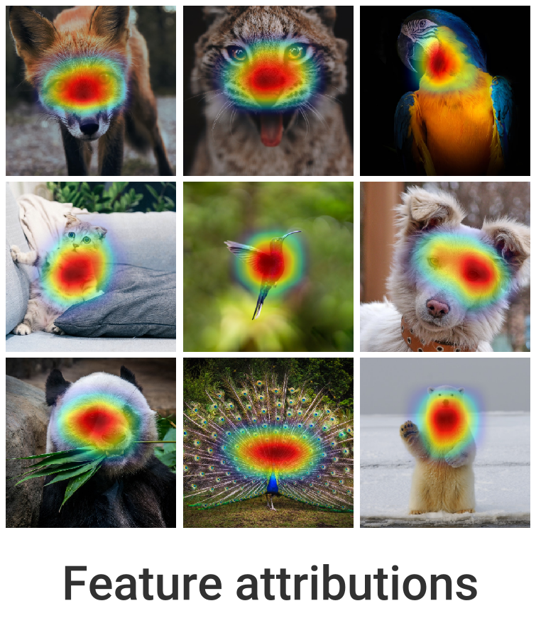
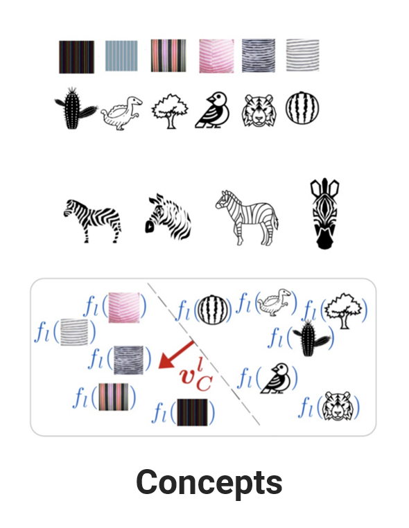

<div align="center">
    
</div>
<br>

<div align="center">
    <a href="#">
        
    </a>
    <a href="https://github.com/deel-ai/xplique/actions/workflows/python-lints.yml">
        
    </a>
    <a href="https://github.com/deel-ai/xplique/actions/workflows/python-tests.yml">
        
    </a>
     <a href="https://github.com/deel-ai/xplique/actions/workflows/python-publish.yml">
        
    </a>
    <a href="#">
        
    </a>
</div>
<br>

<p align="center">
    🦊 <b>Xplique</b> (pronounced <i>\ɛks.plik\</i>) is a Python toolkit dedicated to explainability, currently based on Tensorflow.
    The goal of this library is to gather the state of the art of Explainable AI to help you understand your complex neural network models.
  <br>
  <br>
  <a href="https://deel-ai.github.io/xplique/attributions">Attributions</a>
  ·
  <a href="https://deel-ai.github.io/xplique/concepts">Concept</a>
  ·
  <a href="https://deel-ai.github.io/xplique/feature_visualization">Feature Visualization</a>
  ·
  <a href="https://deel-ai.github.io/xplique/metrics">Metrics</a>
</p>

The library is composed of several modules, the _Attributions Methods_ module implements various methods (e.g Saliency, Grad-CAM, Integrated-Gradients...), with explanations, examples and links to official papers.
The _Feature Visualization_ module allows to see how neural networks build their understanding of images by finding inputs that maximize neurons, channels, layers or compositions of these elements.
The _Concepts_ module allows you to extract human concepts from a model and to test their usefulness with respect to a class.
Finally, the _Metrics_ module covers the current metrics used in explainability. Used in conjunction with the _Attribution Methods_ module, it allows you to test the different methods or evaluate the explanations of a model.

<p align="center" width="100%">
     
     
     
</p>

## 📚 Table of contents

- [📚 Table of contents](#-table-of-contents)
- [🚀 Quick Start](#-quick-start)
- [🔥 Notebooks](#-notebooks)
- [📦 What's Included](#-whats-included)
- [👍 Contributing](#-contributing)
- [👀 See Also](#-see-also)
- [🙏 Acknowledgments](#-acknowledgments)
- [👨‍🎓 Creator](#-creator)
- [📝 License](#-license)

## 🚀 Quick Start

Xplique requires a version of python higher than 3.6 and several libraries including Tensorflow and Numpy. Installation can be done using Pypi:

```python
pip install xplique
```

Now that Xplique is installed, here are 4 basic examples of what you can do with the available modules.

### Attributions Methods

let's start with a simple example, by computing Grad-CAM for several images (or a complete dataset) on a trained model.

```python
from xplique.attributions import GradCAM

# load images, labels and model
# ...

explainer = GradCAM(model)
explanations = explainer.explain(images, labels)
# or just `explainer(images, labels)`
```

### Attributions Metrics

In order to measure if the explanations provided by our method are faithful (it reflects well the functioning of the model) we can use a fidelity metric such as Deletion

```python
from xplique.attributions import GradCAM
from xplique.metrics import Deletion

# load images, labels and model
# ...

explainer = GradCAM(model)
metric = Deletion(model, inputs, labels)

score_grad_cam = metric(explainer)
```

### Concepts Extraction

Concerning the concept-based methods, we can for example extract a concept vector from a layer of a model. In order to do this, we use two datasets, one containing inputs containing the concept: `positive_samples`, the other containing other entries which do not contain the concept: `negative_samples`.

```python
from xplique.concepts import Cav

# load a model, samples that contain a concept
# (positive) and samples who don't (negative)
# ...

extractor = Cav(model, 'mixed3')
concept_vector = extractor(positive_samples,
                           negative_samples)
```

### Feature Visualization

Finally, in order to find an image that maximizes a neuron and at the same time a layer, we build two objectives that we combine together. We then call the optimizer which returns our images

```python
from xplique.features_visualizations import Objective
from xplique.features_visualizations import optimize

# load a model...

neuron_obj = Objective.neuron(model, "logits", 200)
channel_obj = Objective.layer(model, "mixed3", 10)

obj = neuron_obj + 2.0 * channel_obj
images = optimize(obj)
```

## 🔥 Notebooks

- [Using the attributions methods](https://gist.github.com/napolar/c02cef48ae7fc20e76d633f3f1588c63)
  <sub> [](https://colab.research.google.com/gist/napolar/c02cef48ae7fc20e76d633f3f1588c63/sample-generation.ipynb) </sub>

## 📦 What's Included

| **Attribution Method** | Type of Model | Source                                    |
| :--------------------- | :------------ | :---------------------------------------- |
| Deconvolution          | TF            | [Paper](https://arxiv.org/abs/1311.2901)  |
| Grad-CAM               | TF            | [Paper](https://arxiv.org/abs/1610.02391) |
| Grad-CAM++             | TF            | [Paper](https://arxiv.org/abs/1710.11063) |
| Gradient Input         | TF            | [Paper](https://arxiv.org/abs/1711.06104) |
| Guided Backprop        | TF            | [Paper](https://arxiv.org/abs/1412.6806)  |
| Integrated Gradients   | TF            | [Paper](https://arxiv.org/abs/1703.01365) |
| Kernel SHAP            | Callable      | [Paper](https://arxiv.org/abs/1705.07874) |
| Lime                   | Callable      | [Paper](https://arxiv.org/abs/1602.04938) |
| Occlusion              | Callable      | [Paper](https://arxiv.org/abs/1311.2901)  |
| Rise                   | Callable      | [Paper](https://arxiv.org/abs/1806.07421) |
| Saliency               | TF            | [Paper](https://arxiv.org/abs/1312.6034)  |
| SmoothGrad             | TF            | [Paper](https://arxiv.org/abs/1706.03825) |
| SquareGrad             | TF            | [Paper](https://arxiv.org/abs/1806.10758) |
| VarGrad                | TF            | [Paper](https://arxiv.org/abs/1810.03292) |

| **Attribution Metrics** | Type of Model | Property  | Source                                    |
| :---------------------- | :------------ | :-------- | :---------------------------------------- |
| MuFidelity              | TF            | Fidelity  | [Paper](https://arxiv.org/abs/2005.00631) |
| Deletion                | TF            | Fidelity  | [Paper](https://arxiv.org/abs/1806.07421) |
| Insertion               | TF            | Fidelity  | [Paper](https://arxiv.org/abs/1806.07421) |
| Average Stability       | TF            | Stability | [Paper](https://arxiv.org/abs/2005.00631) |
| (WIP) MeGe              |               |           |
| (WIP) ReCo              |               |           |

| **Concepts method**             | Type of Model | Source                                        |
| :------------------------------ | :------------ | :-------------------------------------------- |
| Concept Activation Vector (CAV) | TF            | [Paper](https://arxiv.org/pdf/1711.11279.pdf) |
| Testing CAV                     | TF            | [Paper](https://arxiv.org/pdf/1711.11279.pdf) |
| (WIP) Robust TCAV               |               |

| **Feature Visualization** [(Paper)](https://distill.pub/2017/feature-visualization/) | Type of Model | Details                                                                                                            |
| :----------------------------------------------------------------------------------- | :------------ | :----------------------------------------------------------------------------------------------------------------- |
| Neurons                                                                              | TF            | Optimizes for specific neurons                                                                              |
| Layer                                                                                | TF            | Optimizes for specific layers                                                                               |
| Channel                                                                              | TF            | Optimizes for specific channels                                                                             |
| Direction                                                                            | TF            | Optimizes for specific vector                                                                               |
| Fourrier Preconditioning                                                             | TF            | Optimize in Fourier basis (see [preconditioning](https://distill.pub/2017/feature-visualization/#preconditioning)) |
| Objective combination                                                                | TF            | Allows to combine objectives                                                                                       |

<div align="right">
  <i>methods with TF need a Tensorflow model. </i>
</div>

## 👍 Contributing

Feel free to propose your ideas or come and contribute with us on the Xplique toolbox! We have a specific document where we describe in a simple way how to make your first pull request: [just here](contributing.md).

## 👀 See Also

This library is one approach of many to explain your model. We don't expect it to be the final solution; we create it to explore one point in the space of possibilities.

Other tools to explain your model include:

- [Lucid](https://github.com/tensorflow/lucid) the wonderful library specialized in feature visualization from OpenAI.
- [Captum](https://captum.ai/) the Pytorch library for Interpretability research
- [Tf-explain](https://github.com/sicara/tf-explain) that implement multiples attribution methods and propose callbacks API for tensorflow.
- [Alibi Explain](https://github.com/SeldonIO/alibi) for model inspection and interpretation

To learn more about Explainable AI in general, see:

- [Interpretable Machine Learning](https://christophm.github.io/interpretable-ml-book/) an excellent book by Christophe Molnar.
- [Interpretability Beyond Feature Attribution](https://www.youtube.com/watch?v=Ff-Dx79QEEY) by Been Kim.
- [A Roadmap for the Rigorous Science of Interpretability](https://www.youtube.com/watch?v=MMxZlr_L6YE) by Finale Doshi-Velez.
- [DEEL White paper](https://arxiv.org/abs/2103.10529) a summary of the DEEL team on the challenges of certifiable AI and the role of explainability for this purpose

## 🙏 Acknowledgments


This project received funding from the French ”Investing for the Future – PIA3” program within the Artificial and Natural Intelligence Toulouse Institute (ANITI). The authors gratefully acknowledge the support of the <a href="https://www.deel.ai/"> DEEL </a> project.

## 👨‍🎓 Creator

This library was started as a side-project by [Thomas FEL](https://twitter.com/Napoolar) who is doing a thesis on explainability.

## 📝 License

The package is released under <a href="https://choosealicense.com/licenses/mit"> MIT license</a>.
