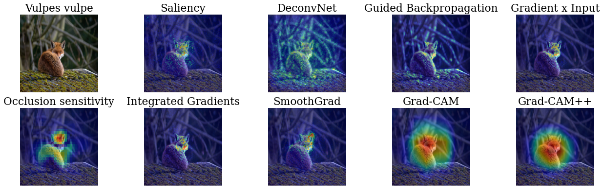

<h1>
    <p align="center">
      
    </p>
</h1>

<p align="center">
    <a href="https://travis-ci.com/napolar/xplique">
        
    </a>
</p>
<br>

---
**Xplique** is a Python module dedicated to explainability. It provides several submodules to learn
more about your tensorflow models (≥2.1). The three main submodules are _Attributions Methods_,
_Explainability Metrics_ and _Feature Visualization_ tools.
---

The _Attributions Method_ submodule implements various methods, with explanations, examples and 
links to official papers.

Soon, the _Explainability Metrics_ submodule will implement the current metrics related to 
explainability. These evaluations used in conjunction with the attribution methods allow to measure
the quality of the explanations.

Soon, the _Feature Visualization_ submodule will allow to represent neurons, channels or layers
by maximizing an input. 

The package is released under [MIT license](https://choosealicense.com/licenses/mit).



## Contents

- [Install](#installing) <br>
- [Get started](#get-started) <br>
- [Core features](#core-features) <br>
    - [Attributions Methods](#attributions-methods) <br>
    - [Concept based Methods](#concept-based-methods) <br>
    - [Metrics](#metrics) <br>
    - [Feature Visualization](#feature-visualization) <br>
- [Notebooks](#notebooks) <br>

## Installing

The library has been tested on Linux, MacOSX and Windows and relies on the following Python modules:

* Tensorflow (>=2.1)
* Numpy (>=1.18)

You can install Xplique using pip with:

```bash
pip install xplique
```

## Getting Started

let's start with a simple example, by computing Grad-CAM for several images (or a complete dataset)
on a trained model.

```python
from xplique.attributions import GradCAM

# load images, labels and model
# ...

method = GradCAM(model)
explanations = method.explain(images, labels)
```

## Notebooks

- [Using the attributions methods](https://gist.github.com/napolar/c02cef48ae7fc20e76d633f3f1588c63)
<sub> [](https://colab.research.google.com/gist/napolar/c02cef48ae7fc20e76d633f3f1588c63/sample-generation.ipynb) </sub>

## Core features

### Attributions Methods

* [x] [ Deconvolution ](./api/deconvnet.md)[^1]
* [x] [ Grad-CAM ](./api/grad_cam.md)[^2]
* [x] [ Grad-CAM++ ](./api/grad_cam_pp.md)[^3]
* [x] [ Gradient Input ](./api/gradient_input.md)[^4]
* [x] [ Guided Backprop ](./api/guided_backpropagation.md)[^5]
* [x] [ Integrated Gradients ](./api/integrated_gradients.md)[^6]
* [x] [ Occlusion ](./api/occlusion.md)[^1]
* [x] [ Rise ](./api/rise.md)[^7]
* [x] [ Saliency ](./api/saliency.md)[^8]
* [x] [ SmoothGrad ](./api/smoothgrad.md)[^9]
* [x] [ SquareGrad ](./api/square_grad.md)[^10]
* [x] [ VarGrad ](./api/vargrad.md)[^11]
* [ ] Ablation-CAM  
* [ ] Xray

### Concept-based Methods

* [x] [ Concept Activation Vector ](./api/cav.md)[^12]
* [x] [ Testing with Concept Activation Vector ](./api/tcav.md)[^12]
* [ ] Robust TCAV
* [ ] Automatic Concept Extraction 

### Metrics

* [ ] Aocp  
* [ ] Fidelity correlation
* [ ] Irof     
* [ ] Pixel Flipping
* [ ] Stability

### Feature Visualization

* [ ] Vanilla

[^1]: [Visualizing and Understanding Convolutional Networks (2013).](https://arxiv.org/abs/1311.2901)
[^2]: [Visual Explanations from Deep Networks via Gradient-based Localization (2016).](https://arxiv.org/abs/1610.02391)
[^3]: [Grad-CAM++: Improved Visual Explanations for Deep Convolutional Networks (2017).](https://arxiv.org/abs/1710.11063)
[^4]: [Not Just a Black Box: Learning Important Features Through Propagating Activation Differences (2016).](https://arxiv.org/abs/1605.01713)
[^5]: [Striving for Simplicity: The All Convolutional Net (2014).](https://arxiv.org/abs/1412.6806)
[^6]: [Axiomatic Attribution for Deep Networks (2017).](https://arxiv.org/abs/1703.01365)
[^7]: [RISE: Randomized Input Sampling for Explanation of Black-box Models (2018).](https://arxiv.org/abs/1806.07421)
[^8]: [Deep Inside Convolutional Networks: Visualising Image Classification Models and Saliency Maps (2013).](https://arxiv.org/abs/1312.6034)
[^9]: [SmoothGrad: removing noise by adding noise (2017).](https://arxiv.org/abs/1706.03825)
[^10]: [A Benchmark for Interpretability Methods in Deep Neural Networks (2019).](https://arxiv.org/abs/1806.10758)
[^11]: [Sanity check for Saliency map (2018).](https://arxiv.org/abs/1810.03292)
[^12]: [Interpretability Beyond Feature Attribution: Quantitative Testing with Concept Activation Vectors (TCAV) (2018).](https://arxiv.org/abs/1711.11279)